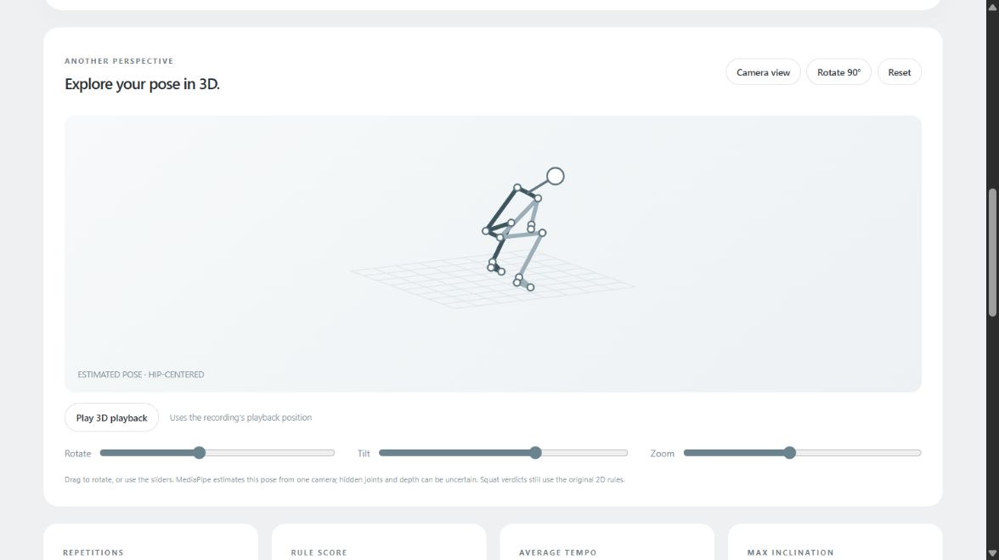

# FORM · Squat Coach

A local web app for reviewing **recorded squat videos**, built around pretrained MediaPipe pose estimation and rules adapted from LearnOpenCV. It provides video playback with a synchronized 2D skeleton, estimated 3D pose, automatic repetition counting, measured feedback, session history, charts, and CSV/PDF reports.

**No new model was trained. Expert-labeled squat-form accuracy has not been evaluated.** Rule scores describe the configured rules, not accuracy, medical safety, or a comprehensive assessment of technique. This version has no live/webcam mode.



## Clone and run

Prerequisites: Git and **64-bit Python 3.11**. Internet access is needed for the first dependency installation. Node is optional: the production frontend is included, so you do not need to rebuild it to run the app.

```powershell
git clone https://github.com/vishnuTheertha1910/squat-coach.git
cd squat-coach
.\start.ps1
```

Open **http://127.0.0.1:8790**. Keep the terminal open; Ctrl+C stops the server. First launch creates `.venv`, installs the pinned Python dependencies, and restores the eight archived sessions into local `data/`. Later launches reuse this setup. If PowerShell blocks scripts, use this process-only invocation:

```powershell
powershell.exe -NoProfile -ExecutionPolicy Bypass -File .\start.ps1
```

Windows was the development and verification platform. `bash start.sh` provides equivalent setup for systems with `python3.11`, but Linux and macOS have not been verified. The full `requirements.lock` records the original Windows environment; launchers use the pinned direct dependencies in `requirements.txt`.

## Review or analyze a recording

1. Open **Sessions** to inspect the bundled results. `3d-review-example.mp4` has estimated world landmarks for the 3D viewer. Older sessions lack these fields and need re-analysis for 3D playback.
2. Choose Beginner or Pro and upload a recording. Use one person, full body including feet visible, a side-on view, clear lighting, and a stationary camera. Start and end standing upright.
3. Play the recording and inspect the skeleton, phase, angle chart, and repetition table. Replay or loop a rep and open its detailed rule feedback. Select **3D pose** to rotate the estimated skeleton.
4. Export CSV or PDF. New uploads and results are stored locally until you delete their session.

Upload limit: **200 MiB**. Decoder limits: one hour, up to 240 FPS, at least 64 pixels in each dimension, and at most 3840 × 2160 pixels in total. MP4 is exercised; MOV, AVI, WebM and MKV are accepted but not exhaustively tested. The app creates an H.264 playback copy and removes audio. FFmpeg is supplied by `imageio-ffmpeg`.

Command-line upload while the server is running:

```powershell
curl.exe --fail-with-body -F "mode=beginner" -F "file=@inputs/output_sample.mp4" http://127.0.0.1:8790/api/sessions
```

The response contains the session ID and `processing` status. Open the session in the UI when complete. Use `mode=pro` for the other preset. The API documentation is at http://127.0.0.1:8790/docs.

## Minimal repository layout

```text
backend/             Pose extraction, rule engine, feedback, API and reports
frontend/            React/TypeScript source and bundled production dist/
tests/               Existing Python regression and API tests
vendor/learnopencv/  Unchanged pinned upstream example snapshot
inputs/              Four distinct saved input recordings
outputs/             Eight session analyses/reports, four playback files, evidence
docs/                Provenance, feature status, evaluation and verification notes
restore_sessions.py  Recreate local session history from outputs/manifest.json
start.ps1, start.sh  Setup and launch
requirements*.txt    Direct dependencies and test dependencies
requirements.lock   Original full Windows environment snapshot
```

There are no nested Git repositories or submodule setup requirements. Video bytes are included in normal Git storage; these files are below GitHub's per-file limit, so no LFS download is needed. Local environments, dependencies, caches, and runtime `data/` are ignored.

`outputs/manifest.json` links every saved session to its input, playback copy, original timestamps, mode, and full analysis. Identical video bytes are stored once per input/output category. Each session has an `analysis.json`, `report.csv`, and `report.pdf`. The manifest includes SHA-256 checksums for the media. Restoring sessions copies the bundled files into the original runtime layout without recomputing predictions:

```powershell
.venv\Scripts\python.exe restore_sessions.py
```

Existing registered sessions are skipped. This explicit command can restore an archived session deleted from the UI. Deleting a runtime session does not erase the committed archive. New sessions are not automatically added to GitHub.

## Method and contribution

```text
Recording → MediaPipe landmarks → image angles → squat phase rules
          → repetition verdicts/timing → synchronized review and reports
```

MediaPipe supplies pretrained 33-landmark pose estimates. The rule engine follows standing → transition → bottom → transition → standing. Beginner and Pro use different configured bands. The application adds recording timestamps, handling of invalid tracking/gaps, persisted totals, the recorded-video workflow, explanatory feedback, 3D visualization, and exports around the upstream approach.

- **Thigh inclination** measures the thigh relative to upward vertical in the image, using upstream rounding. It is a depth proxy, not anatomical knee flexion or depth in centimeters.
- **Rule score** is `100 × correct completed reps / all completed reps`; it is unavailable with zero completed reps.
- **Tempo** starts at the first accepted transition and ends on return to standing. It does not include the earliest motion before that threshold.
- **3D pose** displays MediaPipe's estimated, hip-centered world landmarks from one camera. It is not calibrated motion capture; the 3D coordinates do not determine verdicts.
- Faults and advisory torso cues are distinguished. Missing an accepted bottom phase can reflect tracking/sampling limitations, not necessarily inadequate depth.

## Evidence and limits

The existing suite passed **17 tests** during app development. The archived upstream comparison used one 541-frame clip: both presets matched the original implementation's compared counts, displayed feedback, and states, with one correct and zero improper repetitions. This is bounded reproduction evidence, **not a measured accuracy percentage**. Real failing-fault accuracy and 3D measurement accuracy remain unvalidated.

The user's 24.57-second rear-oblique recording completed processing but yielded zero reps with only 44/737 accepted frames. Processing success does not imply usable analysis. The app currently needs a clearer low-tracking-quality warning; do not interpret a zero count as absence of physical squats.

See [feature status](docs/FEATURE_STATUS.md), [evaluation plan](docs/EVALUATION.md), [repository verification](docs/REPOSITORY_VERIFICATION.md), and the archived [3D checks](outputs/evidence/3D_FEEDBACK_VERIFICATION.md). Archived development notes may refer to the original local folder; their relative `evidence/` references now correspond to `outputs/evidence/`. They record historical checks and pending limits, including the pending independent final integrated review.

## Development

Backend tests:

```powershell
.venv\Scripts\python.exe -m pip install -r requirements-dev.txt
.venv\Scripts\python.exe -m pytest -q tests
```

To rebuild or develop the UI, use Node.js 22 LTS and pnpm 10:

```powershell
cd frontend
pnpm install --frozen-lockfile
pnpm run build
```

Restart the backend after rebuilding. For frontend development, run `pnpm run dev` with the backend at port 8790; Vite proxies `/api`. Production uses `treeshake: false` to avoid the observed Rollup/Recharts build issue. The larger bundle warning is nonfatal.

Stack: Python/FastAPI, SQLite, MediaPipe, OpenCV, FFmpeg, ReportLab; React, TypeScript, Vite, Recharts and CSS/Tailwind. Pose processing is local; this app does not send uploaded videos to a remote inference service. This public repository contains the supplied archived recordings; running the app locally does not make future uploads public.

## Attribution and media

Adapted from [LearnOpenCV's squat trainer](https://github.com/spmallick/learnopencv/tree/cb8089c79eaab366a9d78e125605805c7c77ad5d/AI-Fitness-Trainer-Using-MediaPipe-Analyzing-Squats), pinned at `cb8089c79eaab366a9d78e125605805c7c77ad5d`. The unchanged snapshot and hashes are preserved; see [provenance](docs/SOURCE_PROVENANCE.md) and [input provenance](inputs/README.md).

No blanket open-source or media redistribution license is asserted. The pinned upstream snapshot did not establish a reuse/media license, and the additional recordings are user-supplied with unverified original authorship/license. Public availability is not permission to reuse these assets. Source videos can contain baked-in annotations or other people; those are not outputs generated by this app. The deleted Pexels clips are not included.
